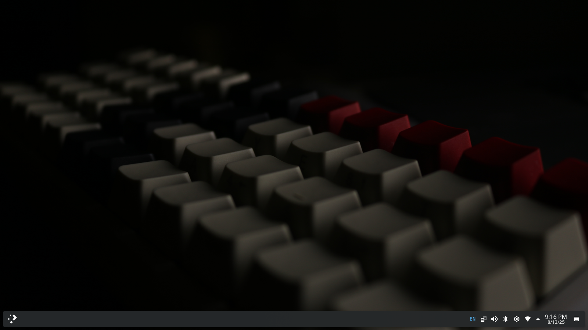

# Debian Workstation

My personal computer desktop and/or laptop designed for technical or scientific applications.

Visit `https://cdimage.debian.org/debian-cd/current/amd64/bt-dvd/`. Download [the image](https://cdimage.debian.org/debian-cd/current/amd64/bt-dvd/debian-13.0.0-amd64-DVD-1.iso.torrent).

```bash
naf@syenasweta:~/home/naf/Downloads/# ls
debian-13.0.0-amd64-DVD-1.iso  SHA256SUMS	SHA256SUMS.sign  SHA512SUMS  SHA512SUMS.sign
```

## Verify the Image

```bash
naf@syenasweta:~/Downloads/# gpg --keyserver keyring.debian.org --recv-keys DA87E80D6294BE9B
naf@syenasweta:~/Downloads/# gpg --list-keys | less
naf@syenasweta:~/Downloads/# gpg --list-keys DA87E80D6294BE9B
naf@syenasweta:~/Downloads/# gpg --verify SHA512SUMS.sign SHA512SUMS
naf@syenasweta:~/Downloads/# sha512sum --check --ignore-missing SHA512SUMS
```

## Write a USB/CD/DVD/BD Image to a USB Flash Drive

```bash
root@syenasweta:~# lsblk
root@syenasweta:~# dd if=/home/naf/Downloads/debian/debian-13.0.0-amd64-DVD-1.iso of=/dev/sdc bs=1M status=progress oflag=sync
```

> [!WARNING]
> This setup under construction!

## Debian Software Repositories

As `root`, add to `/etc/apt/sources.list`.

### Debian Stable

```bash
#deb cdrom:[Debian GNU/Linux 13.0.0 _Trixie_ - Official amd64 NETINST with firmware 20250809-11:20]/ trixie contrib main non-free-firmware

deb http://deb.debian.org/debian/ trixie main non-free-firmware contrib non-free
deb-src http://deb.debian.org/debian/ trixie main non-free-firmware contrib non-free

deb http://security.debian.org/debian-security trixie-security main non-free-firmware contrib non-free
deb-src http://security.debian.org/debian-security trixie-security main non-free-firmware contrib non-free

# trixie-updates, to get updates before a point release is made;
# see https://www.debian.org/doc/manuals/debian-reference/ch02.en.html#_updates_and_backports
deb http://deb.debian.org/debian/ trixie-updates main non-free-firmware contrib non-free    
deb-src http://deb.debian.org/debian/ trixie-updates main non-free-firmware contrib non-free

# This system was installed using removable media other than
# CD/DVD/BD (e.g. USB stick, SD card, ISO image file).
# The matching "deb cdrom" entries were disabled at the end
# of the installation process.
# For information about how to configure apt package sources,
# see the sources.list(5) manual.

# debian-backports
deb http://deb.debian.org/debian trixie-backports main non-free-firmware contrib non-free    
deb-src http://deb.debian.org/debian trixie-backports main non-free-firmware contrib non-free
```

### Debian Testing

Read the document in the link: [https://wiki.debian.org/DebianTesting](https://wiki.debian.org/DebianTesting).

```bash
#deb cdrom:[Debian GNU/Linux 13.0.0 _Trixie_ - Official amd64 NETINST with firmware 20250809-11:20]/ trixie contrib main non-free-firmware

deb http://deb.debian.org/debian/ testing main non-free-firmware contrib non-free
deb-src http://deb.debian.org/debian/ testing main non-free-firmware contrib non-free

deb http://security.debian.org/debian-security testing-security main non-free-firmware contrib non-free
deb-src http://security.debian.org/debian-security testing-security main non-free-firmware contrib non-free

# trixie-updates, to get updates before a point release is made;
# see https://www.debian.org/doc/manuals/debian-reference/ch02.en.html#_updates_and_backports
# deb http://deb.debian.org/debian/ trixie-updates main non-free-firmware contrib non-free
# deb-src http://deb.debian.org/debian/ trixie-updates main non-free-firmware contrib non-free

# This system was installed using removable media other than
# CD/DVD/BD (e.g. USB stick, SD card, ISO image file).
# The matching "deb cdrom" entries were disabled at the end
# of the installation process.
# For information about how to configure apt package sources,
# see the sources.list(5) manual.

# debian-backports
# deb http://deb.debian.org/debian trixie-backports main non-free-firmware contrib non-free
# deb-src http://deb.debian.org/debian trixie-backports main non-free-firmware contrib non-free

```
### List of Debian Sofware

#### `apache2` 
[](https://packages.debian.org/trixie/apache2)

```bash
apt install apache2
```

#### `apache2-doc` 
[](https://packages.debian.org/trixie/apache2-doc)

```bash
apt install apache2-doc
```

#### `apt-transport-https` 
[](https://packages.debian.org/trixie/apt-transport-https)

```bash
apt install apt-transport-https
```

#### `atril` 
[](https://packages.debian.org/trixie/atril)

```bash
apt install atril
```
#### `audacious`  
[](https://packages.debian.org/trixie/audacious)

```bash
apt install audacious
```
#### `audacity`  
[](https://packages.debian.org/trixie/audacity)

```bash
apt install audacity
```
#### `blender`  
[](https://packages.debian.org/trixie/blender)

```bash
apt install blender
```
#### `btop`  
[](https://packages.debian.org/trixie/btop)

```bash
apt install btop
```
#### `calibre`  
[](https://packages.debian.org/trixie/calibre)
```bash
apt install calibre
```
#### `chromium`  
[](https://packages.debian.org/trixie/chromium)

```bash
apt install chromium
```
#### `cocpit`

[](https://packages.debian.org/trixie-backports/cockpit)

```bash
apt install cockpit/trixie-backports
```


#### `color-picker`  

[](https://packages.debian.org/trixie/color-picker)
```bash
apt install color-picker
```
#### `cpu-x`  
[](https://packages.debian.org/trixie/cpu-x)
```bash
apt install cpu-x
```
#### `curl`  
[](https://packages.debian.org/trixie/curl)
```bash
apt install curl
```
#### `ebook-speaker`  
[](https://packages.debian.org/trixie/ebook-speaker)

#### `dconf-editor`

```bash
apt install ebook-speaker
```
#### `ffmpeg`  
[](https://packages.debian.org/trixie/ffmpeg)
```bash
apt install ffmpeg
```
#### `filezilla`  
[](https://packages.debian.org/trixie/filezilla)
```bash
apt install filezilla
```
#### `fonts-crosextra-caladea`  
[](https://packages.debian.org/trixie/fonts-crosextra-caladea)
```bash
apt install fonts-crosextra-caladea
```
#### `fonts-inter` 
[](https://packages.debian.org/trixie/fonts-inter)
```bash
apt install fonts-inter
```
#### `fonts-crosextra-carlito`  
[](https://packages.debian.org/trixie/fonts-crosextra-carlito)
```bash
apt install fonts-crosextra-carlito
```
#### `fonts-jetbrains-mono`  
[](https://packages.debian.org/trixie/fonts-jetbrains-mono)
```bash
apt install fonts-jetbrains-mono
```
#### `font-manager`  
[](https://packages.debian.org/trixie/font-manager)
```bash
apt install font-manager
```
#### `font-viewer` 
[](https://packages.debian.org/trixie/font-viewer)
```bash
apt install font-viewer
```
#### `freecad` 
[](https://packages.debian.org/trixie/freecad)
```bash
apt install freecad
```
#### `freeplane` 
[](https://packages.debian.org/trixie/freeplane)
```bash
apt install freeplane
```
#### `geany` 
[](https://packages.debian.org/trixie/geany)
```bash
apt install geany
```
#### `gdebi` 
[](https://packages.debian.org/trixie/gdebi)
```bash
apt install gdebi
```
#### `gimp` 
[](https://packages.debian.org/trixie/gimp)
```bash
apt install gimp
```
#### `git` 
[](https://packages.debian.org/trixie/git)
```bash
apt install git
```
#### `gnome-power-manager` 
[](https://packages.debian.org/trixie/gnome-power-manager)
```bash
apt install gnome-power-manager
```
#### `gnucash` 
[](https://packages.debian.org/trixie/gnucash)
```bash
apt install gnucash
```
#### `gparted` 
[](https://packages.debian.org/trixie/gparted)
```bash
apt install gparted
```
#### `gscan2pdf` 
[](https://packages.debian.org/trixie/gscan2pdf)
```bash
apt install gscan2pdf
```
#### `gsmartcontrol` 
[](https://packages.debian.org/trixie/gsmartcontrol)
```bash
apt install gsmartcontrol
```
#### `gstreamer1.0-vaapi` 
[](https://packages.debian.org/trixie/gstreamer1.0-vaapi)
```bash
apt install gstreamer1.0-vaapi
```
#### `gthumb` 
[](https://packages.debian.org/trixie/gthumb)
```bash
apt install gthumb
```
#### `hardinfo` 
[](https://packages.debian.org/trixie/hardinfo)
```bash
apt install hardinfo
```
#### `htop` 
[](https://packages.debian.org/trixie/htop)
```bash
apt install htop
```
#### `inkscape` 
[](https://packages.debian.org/trixie/inkscape)
```bash
apt install inkscape
```
#### `img2pdf` 
[](https://packages.debian.org/trixie/img2pdf)

```bash
apt install img2pdf
```
#### `kdenlive` 
[](https://packages.debian.org/trixie/kdenlive)
```bash
apt install kdenlive
```
#### `kicad` 
[](https://packages.debian.org/trixie-backports/kicad)
```bash
apt install kicad/trixie-backports
apt install kicad-footprints/trixie-backports
apt install kicad-libraries/trixie-backports
apt install kicad-packages3d/trixie-backports
apt install kicad-symbols/trixie-backports
apt install kicad-templates/trixie-backports
apt install kicad-doc-en/trixie-backports
apt install kicad-demos/trixie-backports
```
#### `kraft` 
[](https://packages.debian.org/trixie/kraft)
```bash
apt install kraft
```
#### `krita` 
[](https://packages.debian.org/trixie/krita)
```bash
apt install krita
```
#### `libavcodec-extra` 
[](https://packages.debian.org/trixie/libavcodec-extra)
```bash
apt install libavcodec-extra
```
#### `librecad` 
[](https://packages.debian.org/trixie/librecad)

```bash
apt install librecad
```
#### `libxcb-xtest0`

[](https://packages.debian.org/trixie/libxcb-xtest0)

```bash
apt install libxcb-xtest0
```

#### `lshw` 

[](https://packages.debian.org/trixie/lshw)

```bash
apt install lshw
```
#### `nautilus-admin` 

[](https://packages.debian.org/trixie/nautilus-admin)

```bash
apt install nautilus-admin
```

#### `neofetch` 

[](https://packages.debian.org/trixie/neofetch)
```bash
apt install neofetch
```
#### `neovim` 
[](https://packages.debian.org/trixie/neovim)
```bash
apt install neovim
```
#### `nvidia-tesla-470-driver` 

Read the docs:

1. [https://wiki.debian.org/NvidiaGraphicsDrivers](https://wiki.debian.org/NvidiaGraphicsDrivers)
2. [https://wiki.debian.org/NVIDIA%20Optimus#Using_NVIDIA_GPU_as_the_primary_GPU](https://wiki.debian.org/NVIDIA%20Optimus#Using_NVIDIA_GPU_as_the_primary_GPU)
3. [https://www.nvidia.com/en-us/geforce/gaming-laptops/geforce-920m/](https://www.nvidia.com/en-us/geforce/gaming-laptops/geforce-920m/)
4. [https://wiki.archlinux.org/title/NVIDIA_Optimus](https://wiki.archlinux.org/title/NVIDIA_Optimus)

[](https://packages.debian.org/trixie/nvidia-tesla-470-driver)

```bash
apt install nvidia-tesla-470-driver
```
#### `nvidia-detect` 
[](https://packages.debian.org/trixie/nvidia-detect)

```bash
apt install nvidia-detect
```
#### `ocrmypdf` 
[](https://packages.debian.org/trixie/ocrmypdf)
```bash
apt install ocrmypdf
```
#### `obs-studio` 
[](https://packages.debian.org/trixie/obsstudio)

```bash
apt install obs-studio
```
#### `openscad` 
[](https://packages.debian.org/trixie/openscad)
```bash
apt install openscad
```
#### `papirus-icon-theme` 
[](https://packages.debian.org/trixie/papirus-icon-theme)
```bash
apt install papirus-icon-theme
```
#### `partitionmanager` 
[](https://packages.debian.org/trixie/partitionmanager)
```bash
apt install partitionmanager
```
#### `pdfarranger` 
[](https://packages.debian.org/trixie/pdfarranger)
```bash
apt install pdfarranger
```
#### `pdfsam` 
[](https://packages.debian.org/trixie/pdfsam)
```bash
apt install pdfsam
```
#### `pdftk` 
[](https://packages.debian.org/trixie/pdftk)
```bash
apt install pdftk
```
#### `photocollage` 
[](https://packages.debian.org/trixie/photocollage)
```bash
apt install photocollage
```

#### `php` 
[](https://packages.debian.org/trixie/php)
```bash
apt install php
```
#### `poppler-utils` 
[](https://packages.debian.org/trixie/poppler-utils)
```bash
apt install poppler-utils
```
#### `printer-driver-all`  
[](https://packages.debian.org/trixie/printer-driver-all)
```bash
apt install printer-driver-all
```
#### `qdiskinfo`  
[](https://packages.debian.org/trixie/qdiskinfo)
```bash
apt install qdiskinfo
```

#### `rar` 
[](https://packages.debian.org/trixie/rar)
```bash
apt install rar
```
#### `scribus` 
[](https://packages.debian.org/trixie/scribus)
```bash
apt install scribus
```
#### `slic3r` 
[](https://packages.debian.org/trixie/slic3r)
```bash
apt install slic3r
```
#### `sweethome3d` 
[](https://packages.debian.org/trixie/sweethome3d)
```bash
apt install sweethome3d
```
#### `tesseract-ocr` 
[](https://packages.debian.org/trixie/tesseract-ocr)
```bash
apt install tesseract-ocr
```
#### `terminator` 
[](https://packages.debian.org/trixie/terminator)
```bash
apt install terminator
```

#### `texlive` 
[](https://packages.debian.org/trixie/texlive)
```bash
apt install texlive
```

#### `thunar` 
[](https://packages.debian.org/trixie/thunar)
```bash
apt install thunar
```
#### `thunderbird` 
[](https://packages.debian.org/trixie/thunderbird)
```bash
apt install thunderbird
```
#### `ttf-mscorefonts-installer` 
[](https://packages.debian.org/trixie/ttf-mscorefonts-installer)
```bash
apt install ttf-mscorefonts-installer
```
#### `ufw` 
[](https://packages.debian.org/trixie/ufw)
```bash
apt install ufw
```
#### `unrar` 
[](https://packages.debian.org/trixie/unrar)
```bash
apt install unrar
```
#### `usbview` 
[](https://packages.debian.org/trixie/usbview)
```bash
apt install usbview
```
#### `vlc` 
[](https://packages.debian.org/trixie/vlc)
```bash
apt install vlc
```
#### `wget` 
[](https://packages.debian.org/trixie/wget)
```bash
apt install wget
```
#### `wifi-qr` 
[](https://packages.debian.org/trixie/wifi-qr)
```bash
apt install wifi-qr
```

## Non-Debian Software Repositories

#### `chrome`
#### `gh` 
```bash
wget -qO- https://cli.github.com/packages/githubcli-archive-keyring.gpg | tee /etc/apt/keyrings/githubcli-archive-keyring.gpg > /dev/null \
&& chmod go+r /etc/apt/keyrings/githubcli-archive-keyring.gpg \
&& echo "deb [arch=$(dpkg --print-architecture) signed-by=/etc/apt/keyrings/githubcli-archive-keyring.gpg] https://cli.github.com/packages stable main" | tee /etc/apt/sources.list.d/github-cli.list > /dev/null
&& apt update
&& apt install gh
```
#### `odafileconverter`
#### `pandoc`

Download the latest release of Pandoc via `https://github.com/jgm/pandoc/releases/latest`.

```bash
wget https://github.com/jgm/pandoc/releases/download/3.3/pandoc-3.3-1-amd64.deb
```

Install `pandoc-3.3-1-amd64.deb` via Gdebi.

#### `qmk-firmware`

Visit `https://github.com/qmk/qmk_fpm`

```bash
echo "deb https://linux.qmk.fm/ $(lsb_release --codename --short) main" | tee /etc/apt/sources.list.d/qmk.list
wget -qO - https://linux.qmk.fm/gpg_pubkey.txt | gpg --dearmor | tee /etc/apt/trusted.gpg.d/qmk-gpg-pubkey.gpg > /dev/null
apt update && upgrade
apt install qmk
```

#### `signal` 

```bash
wget -O- https://updates.signal.org/desktop/apt/keys.asc | gpg --dearmor > signal-desktop-keyring.gpg
cat signal-desktop-keyring.gpg | tee /usr/share/keyrings/signal-desktop-keyring.gpg > /dev/null

echo 'deb [arch=amd64 signed-by=/usr/share/keyrings/signal-desktop-keyring.gpg] https://updates.signal.org/desktop/apt xenial main' |\
  tee /etc/apt/sources.list.d/signal-xenial.list
  
apt update
apt install signal
```

#### `typora`
```bash
wget -qO - https://typora.io/linux/public-key.asc | tee /etc/apt/trusted.gpg.d/typora.asc
add-apt-repository 'deb https://typora.io/linux ./'
apt update && apt upgrade
apt install typora
```
#### `vscode`

```bash
wget -qO- https://packages.microsoft.com/keys/microsoft.asc
gpg --dearmor > packages.microsoft.gpg
install -D -o root -g root -m 644 packages.microsoft.gpg /etc/apt/keyrings/packages.microsoft.gpg
echo "deb [arch=amd64,arm64,armhf signed-by=/etc/apt/keyrings/packages.microsoft.gpg] https://packages.microsoft.com/repos/code stable main" | tee /etc/apt/sources.list.d/vscode.list > /dev/null
rm -f packages.microsoft.gpg
apt update && apt upgrade
apt install code
```

#### `zotero`

Visit [https://www.zotero.org/download/](https://www.zotero.org/download/) and download the latest version of Zotero. As `root`:

```bash
cd /opt
wget https://download.zotero.org/client/release/7.0.22/Zotero-7.0.22_linux-x86_64.tar.bz2
tar -xjvf Zotero-7.0.22_linux-x86_64.tar.bz2
rm -rf Zotero-7.0.22_linux-x86_64.tar.bz2
mkdir zotero
cd Zotero_linux-x86_64
mv * /opt/zotero/
cd /opt
rm -rf Zotero_linux-x86_64
cd zotero
chmod +x set_launcher_icon
./set_launcher_icon # or bash set_launcher_icon
cd /
ln -s /opt/zotero/zotero.desktop /home/naf/.local/share/applications/zotero.desktop
```

##### `zotero-better-bibtex`

Visit [https://github.com/retorquere/zotero-better-bibtex/releases/latest](https://github.com/retorquere/zotero-better-bibtex/releases/latest) and download `.xpi`file.

Run Zotero.

1. In the main menu go to Tools > Add-ons
2. Select ‘Extensions’
3. Click on the gear in the top-right corner and choose ‘Install Add-on From File…’
4. Choose .xpi that you’ve just downloaded, click ‘Install’
5. Restart Zotero if you’re using Zotero 6


## Notes

### Delete Gnome games.

```bash
apt purge gnome-games
```

### Change Background Grub

Set `grub` background image `/etc/default/grub`.

```bash
GRUB_BACKGROUND=""
```

```bash
update-grub
```

### Change GDM Background

Copy image to `/usr/share/images/vendor-logos/`:

```bash
cp syenasweta-logo-text-version-64.svg /usr/share/images/vendor-logos/
```

Edit file in ` /etc/gdm3/greeter.dconf-defaults`. Add this:

```bash
# Login manager options
# =====================
[org/gnome/login-screen]
#logo='/usr/share/images/vendor-logos/logo-text-version-64.png'
logo='/usr/share/images/vendor-logos/syenasweta-logo-text-version-64.svg'
```

And:

```bash
dpkg-reconfigure gdm3
```

- `https://wiki.debian.org/GDM#Customizing_the_GDM_appearance`

### Disable the user list


Edit file in ` /etc/gdm3/greeter.dconf-defaults`. Uncomment `disable-user-list=true`:

```bash
# - Disable user list
# disable-user-list=true
disable-user-list=true
```

And:

```bash
dpkg-reconfigure gdm3
```

## Add on

- https://extensions.gnome.org/extension/4269/alphabetical-app-grid/

- https://cockpit-project.org/running.html#debian
- Zoom
- Bibtex

### Configure LAMP

- https://wiki.debian.org/LaMp


## Flathub

I am not using Flatpak yet.

- https://flathub.org/apps/org.kde.kdenlive
- https://flathub.org/apps/com.obsproject.Studio
- https://flathub.org/apps/dev.storyapps.starc

## Credits

Coming soon.